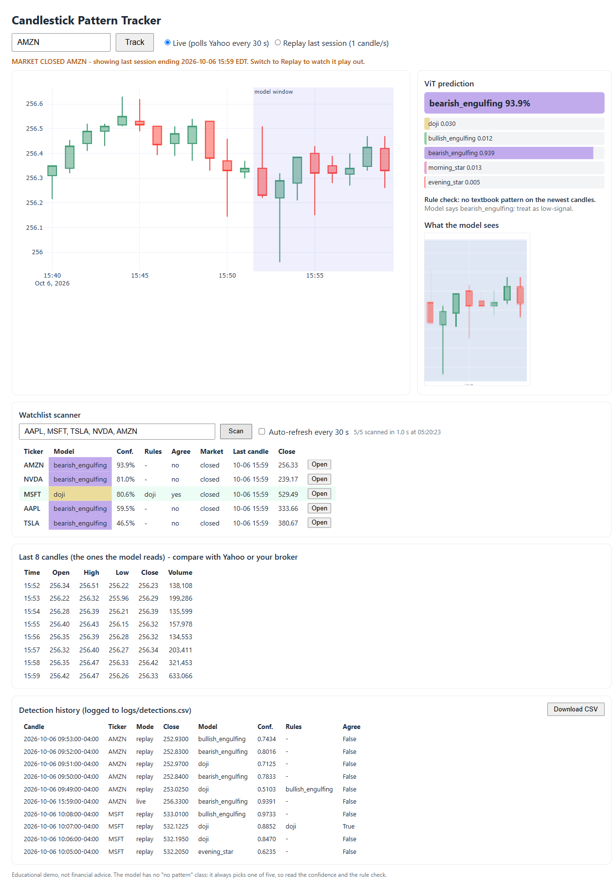

# Vision Transformers to Predict Candlestick Patterns

A Vision Transformer (ViT) that recognises candlestick patterns on a live stock chart. Type a ticker, and the app pulls 1-minute candles from Yahoo Finance, draws the last 20 as a chart, and classifies the most recent eight candles. A plain-OHLC rule check runs beside the model so you can see when they disagree.

**Patterns detected:** doji, bullish engulfing, bearish engulfing, morning star, evening star.



*Here the model says `bearish_engulfing` at 93.9% while the rule check finds no pattern. That kind of disagreement is exactly what the rule check is for; see **Caveats**.*

## Setup

Requires Python 3.13+ and [uv](https://docs.astral.sh/uv/).

```bash
pip install uv
git clone https://github.com/maahin-1/Vision-Transformers-to-Predict-Candlestick-Patterns.git
cd Vision-Transformers-to-Predict-Candlestick-Patterns
uv sync
uv run download_model.py
```

`download_model.py` fetches the trained checkpoint (`checkpoints/25_model.pt`, about 98 MB) from this repository's GitHub Releases. If you would rather train your own, skip it and see **Training**.

## Running the app

```bash
uv run src/app.py
```

Open http://127.0.0.1:8050, type a ticker (`AAPL`, `TSLA`, `RELIANCE.NS`, ...) and press **Track**.

| Mode | What it does |
|---|---|
| **Live** | Polls Yahoo Finance every 30 s and predicts on the newest *closed* candles. Yahoo data can be delayed by minutes depending on the exchange. When the market is closed it shows the last session, labelled "MARKET CLOSED". |
| **Replay** | Replays the latest session one candle per second. Use it after hours or to test. |

The page shows:

- the candlestick chart, with the eight candles the model reads highlighted;
- the model's probability for each class (a "weak" tag appears below 50%);
- a rule check, using textbook OHLC definitions, saying whether it agrees with the model;
- "What the model sees", the exact 72 x 104 px crop fed to the network;
- the OHLCV table of those eight candles, so you can compare against Yahoo or your broker.
- a **watchlist scanner**: enter up to 20 tickers (`AAPL, MSFT, TSLA`) and press **Scan** to see each one's current pattern, confidence, rule agreement and last candle, sorted by confidence. Rows where the model and the rule check agree are tinted green, and **Open** loads a ticker into the main view. Tick *Auto-refresh* to rescan every 30 s. A bad or unknown ticker only affects its own row;
- a detection history (newest 10 rows) with a **Download CSV** button. Every new candle's prediction is appended to `logs/detections.csv` (time, ticker, mode, close, model class and confidence, rule patterns, whether they agree), so you can review how the model behaved later. The `logs/` folder is git-ignored.

Press `Ctrl+C` in the terminal to stop.

### How the prediction works

The model was trained on screenshots of a Plotly chart showing 20 candles. The app draws the same kind of picture from the candle data (`src/render.py`) and runs it through the same resize and crop as training, so it does not read your screen and does not depend on window position. On 150 freshly generated pattern charts the rendered images were classified 100% correctly; the model scores 99.5% on its own labelled test screenshots.

### Caveats

- The training data is synthetic (randomly generated candles shaped into each pattern), so real markets can give confident but wrong answers. Check the rule row and the table.
- The model has no "no pattern" class. It always picks one of the five.
- Educational project, not financial advice.

## Optional: screen-capture predictor

`candlestick_prediction.py` is the original approach: it captures a monitor, crops a fixed region and shows a small preview window. It only works when a chart in the training layout fills that region (for example the Plotly chart in a maximised browser at 100% zoom).

```bash
uv run candlestick_prediction.py [--monitor N] [--fps N] [--full-overlay]
```

Press `q` or `Esc` in the preview window, or `Ctrl+C`, to stop.

## Training

```bash
mkdir checkpoints
uv run src/train.py
```

Training reads `data/train_data` and `data/test_data` (images plus `labels.csv`) and saves a checkpoint every 5 epochs to `checkpoints/`. Evaluate one with `uv run src/test.py`, which writes `results.png`. `src/utils/datageneration_*.py` generate the synthetic charts and `src/utils/annotator.py` helps label them.

## Tests

```bash
uv run pytest
```

## Project layout

```
src/app.py                  Dash app: ticker input, chart, prediction, rule check
src/market.py               Yahoo Finance data and market status
src/history.py              CSV log of every prediction
src/scanner.py              watchlist scan (parallel fetch, sequential inference)
src/render.py               draws the 20-candle chart image the model expects
src/predictor.py            loads the ViT and runs inference
src/rules.py                OHLC definitions of the five patterns
src/model.py                ViT architecture
src/data.py                 dataset and augmentations
src/train.py, src/test.py   training and evaluation
src/utils/                  data generation and labelling tools
candlestick_prediction.py   optional screen-capture predictor
download_model.py           fetch the trained checkpoint
data/                       labelled training and test images
tests/                      unit tests
```

## Model

Input is the cropped chart region (72 x 104 px, eight candles), split into 8 x 8 patches. A class token and sinusoidal positional embeddings feed 3 transformer encoder layers (1024-dim, 8 heads), followed by a 5-way classification head.

## Troubleshooting

- **"No 1-minute data":** check the symbol. Non-US markets need a suffix (`.NS`, `.L`, `.TO`). Yahoo only serves 1-minute data for roughly the last week.
- **Live mode shows an old session:** the market is closed or the exchange feed is delayed. Switch to Replay.
- **Download fails:** get `25_model.pt` from the Releases page and put it in `checkpoints/`.
- **System slows down:** inference runs on CPU. Close heavy apps; the app itself uses a few hundred MB.

## Credits and license

Maintained by Maahin Bir Singh Osahan ([@maahin-1](https://github.com/maahin-1)).

Released under the MIT License; see [LICENSE](LICENSE).
